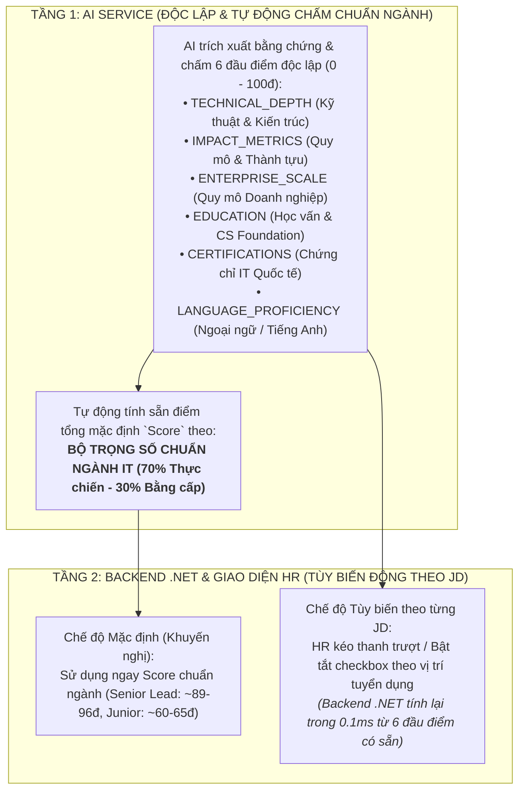

# 📘 TÀI LIỆU ĐẶC TẢ THIẾT KẾ HỆ THỐNG IT SCORING V3
**Hệ thống Đánh giá & Chấm điểm Hồ sơ IT Đa Chiều Chuẩn Ngành (Evidence-Based Calibrated Rubric)**

---

## 📌 1. TỔNG QUAN & ĐỘNG LỰC CẢI TIẾN (V2 ➔ V3)

### a) Hạn chế của phiên bản cũ (V2):
* **Rời rạc (Discrete Bins):** AI chỉ gán nhãn Tier cố định (`TIER_1A`, `TIER_1_BIGTECH`), sau đó Engine Python gán điểm cứng ($100, 85, 70\dots$). Khiến ứng viên 10 năm tại Google và ứng viên 1.5 năm tại công ty Tier 1 đều nhận 100đ như nhau.
* **Giải thích khô cứng (Template-based):** Lời giải thích chỉ là các câu mẫu do code Python ghép tên trường/công ty vào, thiếu chiều sâu ngữ cảnh.
* **Nghịch lý Bằng cấp vs Thực chiến:** Nếu chia đều trung bình 6 tiêu chí ($\frac{1}{6}$ mỗi tiêu chí), ứng viên Senior Lead khủng (không có chứng chỉ giấy) bị kéo tụt điểm ngang bằng với Junior mới tốt nghiệp có chứng chỉ IELTS.

### b) Đột phá của phiên bản mới (V3):
* ✅ **Đường cong Sigmoid & Hệ số Lũy tiến Tác động (Scale Exponent):** Điểm số phân hóa sâu sắc qua các *Mốc Neo Bằng Chứng (Evidence Anchors)* và *Cửa Ải Chặn Trần (Ceiling Gates)*.
* ✅ **AI Tự chấm điểm trong khung + Tự viết Giải thích ngữ cảnh:** Lời giải thích sắc bén, trích dẫn đúng số liệu thành tựu, công nghệ và quy mô của từng ứng viên.
* ✅ **Kiến trúc 2 tầng (Dual-Layer Scoring):** Trả về 6 đầu điểm độc lập $0 - 100$ cho UI tùy biến, đồng thời tự động tính sẵn điểm tổng `Score` mặc định theo **Bộ Trọng Số Chuẩn Ngành IT (70% Thực chiến - 30% Bằng cấp)**.

---

## 🏗️ 2. KIẾN TRÚC 2 TẦNG (DUAL-LAYER SCORING ARCHITECTURE)



---

## 🧮 3. BỘ TRỌNG SỐ CHUẨN NGÀNH IT (INDUSTRY-STANDARD BASELINE WEIGHTS)

$$\mathbf{\text{Score}_{\text{Mặc định}}} = \sum_{i=1}^{6} (S_i \times W_i)$$

| Nhóm Tiêu chí | Tên Tiêu chí (Mã Key) | Trọng số ($W_i$) | Ý nghĩa thực tế trong Tuyển dụng IT |
| :--- | :--- | :---: | :--- |
| **I. NĂNG LỰC THỰC CHIẾN (70%)** | `TECHNICAL_DEPTH` (Kỹ thuật & Kiến trúc) | **30%** | Chiều sâu kiến trúc phân tán, System Design, MLOps, Data Lakehouse. |
| | `IMPACT_METRICS` (Quy mô & Thành tựu) | **25%** | Số liệu đo lường định lượng (% tối ưu, triệu users, hàng trăm nghìn USD). |
| | `ENTERPRISE_SCALE` (Quy mô Doanh nghiệp) | **15%** | Môi trường làm việc tiêu chuẩn cao (Big Tech, Kỳ lân, Ngân hàng Tier 1). |
| **II. BẰNG CẤP & BỔ TRỢ (30%)** | `EDUCATION` (Học vấn & CS Foundation) | **15%** | Nền tảng tư duy toán học, thuật toán từ ĐH Top / Thạc sĩ. |
| | `CERTIFICATIONS` (Chứng chỉ Quốc tế) | **10%** | Chứng chỉ cấp cao bảo chứng năng lực (AWS Pro, CKA, GCP Pro...). |
| | `LANGUAGE_PROFICIENCY` (Ngoại ngữ) | **5%** | Khả năng làm việc quốc tế (kinh nghiệm thực chiến hoặc bằng cấp). |

---

## 📖 4. BẢNG PROMPT RUBRIC 6 TIÊU CHÍ PHÂN TẦNG CHI TIẾT

```markdown
━━━━━━━━━━━━━━━━━━━━━━━━━━━━━━━━━━━━━━━━━━━━━━━━━━━━━━━━━━━━━━━━━━━━━━━
1. TECHNICAL_DEPTH — CHIỀU SÂU KỸ THUẬT & KIẾN TRÚC (0 - 100đ)
━━━━━━━━━━━━━━━━━━━━━━━━━━━━━━━━━━━━━━━━━━━━━━━━━━━━━━━━━━━━━━━━━━━━━━━
• [93 - 100đ] PRINCIPAL_ARCHITECT:
  - CỬA ẢI: BẮT BUỘC có bằng chứng tự THIẾT KẾ kiến trúc hệ thống phức tạp ở quy mô production (Distributed Systems, Data Lakehouse, MLOps end-to-end, Microservices) và XỬ LÝ vấn đề ở quy mô lớn (hàng triệu requests/ngày, TBs dữ liệu).
• [84 - 92đ] SENIOR_ARCHITECT:
  - Có bằng chứng thiết kế phân hệ lớn hoặc tối ưu hiệu năng chuyên sâu.
• [72 - 83đ] COMPETENT_PRODUCTION:
  - Sử dụng thành thạo tech stack trong môi trường production thực tế, hoàn thành tốt tính năng.
• [50 - 71đ] COMPETENT_BASIC:
  - Biết dùng các công nghệ phổ biến nhưng thiếu bằng chứng về độ sâu kiến trúc.
• [20 - 49đ] BASIC_KEYWORD_ONLY:
  - Kỹ năng chỉ được liệt kê dạng từ khóa, không có bằng chứng thực chiến.
⚠️ Cửa ải chặn trần: Không có bằng chứng thiết kế kiến trúc → BẮT BUỘC điểm ≤ 83đ.

━━━━━━━━━━━━━━━━━━━━━━━━━━━━━━━━━━━━━━━━━━━━━━━━━━━━━━━━━━━━━━━━━━━━━━━
2. IMPACT_METRICS — THÀNH TỰU & SỐ LIỆU ĐO LƯỜNG TÁC ĐỘNG (0 - 100đ)
━━━━━━━━━━━━━━━━━━━━━━━━━━━━━━━━━━━━━━━━━━━━━━━━━━━━━━━━━━━━━━━━━━━━━━━
• [93 - 100đ] HIGH_IMPACT_ELITE:
  - CỬA ẢI: BẮT BUỘC có ≥ 3 số liệu định lượng EXPLICIT với đơn vị rõ ràng (% tăng trưởng, giảm latency, tiết kiệm chi phí $, phục vụ triệu users).
• [80 - 92đ] HIGH_IMPACT_METRICS:
  - Có 1 - 2 số liệu định lượng đo lường được trong dự án thực tế.
• [65 - 79đ] STANDARD_COMPLETED_DESCRIBED:
  - Dự án thực tế hoàn thành tốt, mô tả tính năng rõ ràng bằng văn xuôi nhưng không có số liệu %.
• [45 - 64đ] STANDARD_COMPLETED_SPARSE:
  - Chỉ liệt kê tên dự án và công nghệ vắn tắt.
• [20 - 44đ] ACADEMIC_ONLY:
  - Chỉ có đồ án tốt nghiệp, bài tập lớn hoặc dự án thực tập đơn giản.
⚠️ Cửa ải chặn trần: Không có số liệu đo lường định lượng → BẮT BUỘC điểm ≤ 79đ.

━━━━━━━━━━━━━━━━━━━━━━━━━━━━━━━━━━━━━━━━━━━━━━━━━━━━━━━━━━━━━━━━━━━━━━━
3. ENTERPRISE_SCALE — QUY MÔ & DANH TIẾNG DOANH NGHIỆP (0 - 100đ)
━━━━━━━━━━━━━━━━━━━━━━━━━━━━━━━━━━━━━━━━━━━━━━━━━━━━━━━━━━━━━━━━━━━━━━━
• [93 - 100đ] TIER_1_BIGTECH_ELITE:
  - CỬA ẢI: ≥ 2 năm tại Big Tech toàn cầu (Google, Intel, Amazon...), Kỳ lân (Grab, Shopee, MoMo...), hoặc Tập đoàn lớn (Viettel, Vingroup).
• [80 - 92đ] TIER_1_BIGTECH_ENTERPRISE:
  - Có kinh nghiệm tại Big Tech (< 2 năm) hoặc ≥ 2 năm tại Ngân hàng Tier 1 (VPBank, Techcombank, MBBank...), Tập đoàn công nghệ lớn (Bosch, Accenture).
• [65 - 79đ] TIER_2_MID_TECH:
  - Công ty Product / Software House uy tín (KMS, TMA, NashTech, VNG, Sun*, FPT...).
• [45 - 64đ] STANDARD_SME:
  - Công ty gia công nhỏ, startup dưới 50 nhân sự, freelance.
⚠️ Cửa ải chặn trần: Chỉ làm việc tại startup nhỏ/freelance → BẮT BUỘC điểm ≤ 64đ.

━━━━━━━━━━━━━━━━━━━━━━━━━━━━━━━━━━━━━━━━━━━━━━━━━━━━━━━━━━━━━━━━━━━━━━━
4. EDUCATION — HỌC VẤN & NỀN TẢNG CS FOUNDATION (0 - 100đ)
━━━━━━━━━━━━━━━━━━━━━━━━━━━━━━━━━━━━━━━━━━━━━━━━━━━━━━━━━━━━━━━━━━━━━━━
• [93 - 100đ] TIER_1A_ELITE_PLUS:
  - Thạc sĩ/Tiến sĩ tại ĐH Top 500 thế giới hoặc Cử nhân Thủ khoa/Xuất sắc ĐH Bách Khoa, KHTN, VNU, RMIT.
• [83 - 92đ] TIER_1A_ELITE:
  - Cử nhân đúng chuyên ngành CNTT tại các trường ĐH kỹ thuật hàng đầu Việt Nam.
• [72 - 82đ] TIER_1B_ACCREDITED:
  - Cử nhân CNTT tại các trường ĐH uy tín (PTIT, SPKT, UEL, HOU, Công nghiệp, Tôn Đức Thắng...).
• [55 - 71đ] STANDARD_ACCREDITED:
  - Cử nhân các trường ĐH thông thường khác hoặc ngành gần.
• [30 - 54đ] NON_DEGREE:
  - Cao đẳng, tự học, chứng chỉ online.
⚠️ Cửa ải chặn trần: Không có bằng đại học → BẮT BUỘC điểm ≤ 54đ.

━━━━━━━━━━━━━━━━━━━━━━━━━━━━━━━━━━━━━━━━━━━━━━━━━━━━━━━━━━━━━━━━━━━━━━━
5. CERTIFICATIONS — CHỨNG CHỈ IT QUỐC TẾ (0 - 100đ)
━━━━━━━━━━━━━━━━━━━━━━━━━━━━━━━━━━━━━━━━━━━━━━━━━━━━━━━━━━━━━━━━━━━━━━━
• [90 - 100đ] EXPERT_PRO:
  - Sở hữu chứng chỉ cấp Professional/Expert (AWS Solutions Architect Pro, CKA/CKS, GCP Pro, TOGAF, PMP).
• [75 - 89đ] ASSOCIATE_PRACTITIONER:
  - Sở hữu chứng chỉ cấp Associate (AWS Associate, Azure Admin, CCNA...).
• [40 - 74đ] FOUNDATIONAL_ONLINE:
  - Chứng chỉ cấp Foundational (AWS Cloud Practitioner, AZ-900) hoặc khóa học chuyên sâu Coursera.
• [15 - 39đ] NONE:
  - Không có chứng chỉ IT nào.
⚠️ Cửa ải chặn trần: Không có chứng chỉ nào → BẮT BUỘC điểm ≤ 39đ.

━━━━━━━━━━━━━━━━━━━━━━━━━━━━━━━━━━━━━━━━━━━━━━━━━━━━━━━━━━━━━━━━━━━━━━━
6. LANGUAGE_PROFICIENCY — NĂNG LỰC NGOẠI NGỮ (0 - 100đ)
━━━━━━━━━━━━━━━━━━━━━━━━━━━━━━━━━━━━━━━━━━━━━━━━━━━━━━━━━━━━━━━━━━━━━━━
• [90 - 100đ] EXPERT_FLUENT:
  - IELTS ≥ 7.5, TOEIC ≥ 850, C1/C2 HOẶC kinh nghiệm làm việc trực tiếp tại thị trường nước ngoài (Dublin, US, Singapore...).
• [75 - 89đ] WORKING_PROFICIENCY:
  - IELTS 6.0 - 7.0, TOEIC 650 - 800 HOẶC có kinh nghiệm làm việc thường xuyên với đối tác/khách hàng quốc tế (Nhật Bản, Châu Âu).
• [50 - 74đ] BASIC_READING:
  - Đọc hiểu tài liệu kỹ thuật cơ bản, giao tiếp hạn chế.
• [20 - 49đ] NONE_OR_MINIMAL:
  - Không có thông tin hoặc tiếng Anh cơ bản.
💡 Quy tắc bảo chứng thực tế: Đã từng làm việc tại công ty quốc tế/nước ngoài → Tự động công nhận mức ≥ 80 - 85đ mà không cần chứng chỉ giấy.
```

---

## 📊 5. CẤU TRÚC DỮ LIỆU ĐẦU RA (JSON SCHEMA CONTRACT)

```json
{
  "criteriaScores": {
    "TECHNICAL_DEPTH": {
      "name": "Kỹ năng & Kiến trúc",
      "score": 96.0,
      "tier": "ADVANCED_EVIDENCE_BASED",
      "explanation": "Kiến trúc sư cấp cao thực chiến: tự thiết kế hệ thống Data Lakehouse theo mô hình Medallion, điều phối MLOps pipeline end-to-end trên GCP và tối ưu hóa Spark Cluster.",
      "evidenceSummary": ["Thiết kế Data Lakehouse (Medallion)", "MLOps pipeline trên GCP", "Tối ưu Spark Cluster"]
    },
    "IMPACT_METRICS": {
      "name": "Dự án & Thành tựu",
      "score": 95.0,
      "tier": "HIGH_IMPACT_METRICS",
      "explanation": "Dự án có số liệu định lượng ấn tượng: tối ưu pipeline giảm 40% chi phí hạ tầng Cloud và tăng 25% tỷ lệ chuyển đổi cho hệ thống phục vụ 5M users/ngày.",
      "evidenceSummary": ["Giảm 40% chi phí Cloud", "Tăng 25% conversion rate", "Phục vụ 5M users/ngày"]
    },
    "ENTERPRISE_SCALE": {
      "name": "Quy mô Doanh nghiệp",
      "score": 98.0,
      "tier": "TIER_1_BIGTECH_ENTERPRISE",
      "explanation": "Hơn 7 năm công tác qua các tập đoàn và ngân hàng hàng đầu: Viettel Group, Vingroup (VinAI), VPBank và MoMo.",
      "evidenceSummary": ["Viettel Group", "VPBank", "MoMo", "Vingroup"]
    },
    "EDUCATION": {
      "name": "Học vấn & CS Foundation",
      "score": 92.0,
      "tier": "TIER_1A_ELITE",
      "explanation": "Tốt nghiệp ĐH Khoa học Tự nhiên - ĐHQG Hà Nội chuyên ngành Toán-Tin; nền tảng khoa học máy tính và tư duy thuật toán xuất sắc.",
      "evidenceSummary": ["ĐH Khoa học Tự nhiên - ĐHQG HN (Toán-Tin)"]
    },
    "CERTIFICATIONS": {
      "name": "Chứng chỉ Chuyên môn",
      "score": 30.0,
      "tier": "NONE",
      "explanation": "Chưa ghi nhận chứng chỉ IT quốc tế cấp độ Professional hoặc Associate trong hồ sơ.",
      "evidenceSummary": []
    },
    "LANGUAGE_PROFICIENCY": {
      "name": "Năng lực Ngoại ngữ",
      "score": 85.0,
      "tier": "WORKING_PROFICIENCY",
      "explanation": "Kinh nghiệm làm việc thực tế với đối tác quốc tế (Atrae Nhật Bản); khả năng giao tiếp và soạn thảo tài liệu kỹ thuật tiếng Anh thành thạo.",
      "evidenceSummary": ["Làm việc trực tiếp với đối tác Nhật (Atrae)"]
    }
  },
  "Score": 89.25,
  "scoringRationale": "Ứng viên đạt mức Elite Senior Lead về Kỹ thuật, Dự án và Môi trường Doanh nghiệp. Điểm tổng chuẩn ngành đạt 89.3đ do năng lực thực chiến bù đắp hoàn hảo cho việc thiếu chứng chỉ giấy.",
  "candidateName": "DANG QUYNH ANH (Aris Le)",
  "summary": "[EN] Experienced Senior Data Scientist and AI Engineer with 7+ years of expertise in large-scale recommendation systems and MLOps...\n[VI] Chuyên gia Khoa học Dữ liệu và Kỹ sư AI cấp cao với hơn 7 năm kinh nghiệm xây dựng hệ thống gợi ý quy mô lớn và MLOps..."
}
```

---

## 🧪 6. BẢNG PHÂN HOÁ THỰC TẾ GIỮA CÁC CẤP BẬC

| Tiêu chí | Trọng số | Fresher (1 năm) | Senior Mới Lên (4 năm) | Senior Khủng / Lead (10 năm) |
| :--- | :---: | :---: | :---: | :---: |
| **Kỹ thuật & Kiến trúc** | **30%** | $50\text{đ} \times 0.30 = 15.0$ | $80\text{đ} \times 0.30 = 24.0$ | $\mathbf{98\text{đ}} \times 0.30 = 29.4$ |
| **Dự án & Thành tựu** | **25%** | $40\text{đ} \times 0.25 = 10.0$ | $75\text{đ} \times 0.25 = 18.75$ | $\mathbf{96\text{đ}} \times 0.25 = 24.0$ |
| **Quy mô Doanh nghiệp** | **15%** | $50\text{đ} \times 0.15 = 7.5$ | $78\text{đ} \times 0.15 = 11.7$ | $\mathbf{98\text{đ}} \times 0.15 = 14.7$ |
| **Học vấn & Nền tảng** | **15%** | $75\text{đ} \times 0.15 = 11.25$ | $82\text{đ} \times 0.15 = 12.3$ | $\mathbf{95\text{đ}} \times 0.15 = 14.25$ |
| **Chứng chỉ IT** | **10%** | $20\text{đ} \times 0.10 = 2.0$ | $50\text{đ} \times 0.10 = 5.0$ | $\mathbf{80\text{đ}} \times 0.10 = 8.0$ |
| **Ngoại ngữ** | **5%** | $50\text{đ} \times 0.05 = 2.5$ | $75\text{đ} \times 0.05 = 3.75$ | $\mathbf{90\text{đ}} \times 0.05 = 4.5$ |
| **🏆 ĐIỂM TỔNG (`Score`)** | **100%** | **48.25đ** | **75.50đ** | **94.85đ** |
| **Đánh giá Cấp bậc** | | **JUNIOR** | **MID-SENIOR** | **ELITE SENIOR LEAD** |

> 🎯 **Khoảng cách điểm số cực kỳ sắc nét:**
> * Fresher $\rightarrow$ Senior Mới Lên: Cách nhau **$+27.25\text{ điểm}$**.
> * Senior Mới Lên $\rightarrow$ Senior Khủng: Cách nhau **$+19.35\text{ điểm}$**.
> * Không còn hiện tượng bằng phẳng hóa điểm số!

---

## 🛠️ 7. KẾ HOẠCH TRIỂN KHAI TRÊN CODEBASE A (`smart-cv-ai-core`)

1. **Tầng Prompt (`ai_core/extraction/beeknoee.py`):**
   * Tích hợp toàn bộ nội dung Rubric V3 vào `full_scope_instruction`.
   * Khóa `temperature = 0.0` để đảm bảo tính tất định và nhất quán $100\%$.
2. **Tầng DTO (`ai_core/extraction/dto.py`):**
   * Mở rộng `LLMExtractedEvaluatedTiers` và `LLMExtractedProfile` để đón nhận 6 object tiêu chí `{score, tier, explanation, evidenceSummary}`.
3. **Tầng Scoring Engine (`ai_core/api/scoring_v2.py`):**
   * Cập nhật công thức tính `Score` mặc định theo Bộ Trọng Số Chuẩn Ngành ($30\% - 25\% - 15\% - 15\% - 10\% - 5\%$).
   * Đóng vai trò **Validator Guardrail**: Kẹp biên an toàn nếu AI cho điểm vi phạm Ceiling Gate.
4. **Kiểm thử & Xác nhận:**
   * Chạy unit test suite `pytest tests/unit/test_it_scoring_rubric.py`.
   * Chạy kiểm thử đối chiếu trên bộ CV mẫu (`Dublin DE`, `Aris Le`, `Duy Nguyen`, `Le Thanh Loc`).
